## Этапы выполнения

### Создание облачной инфраструктуры

Стейт основной конфигурации сохраняется в бакете

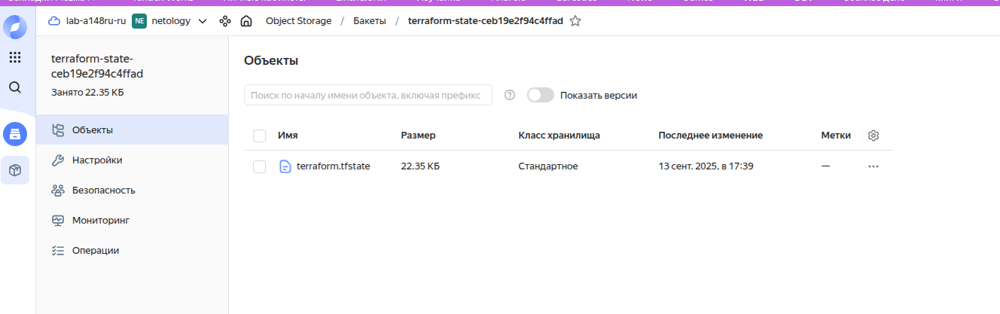

```
terraform {
  required_providers {
    yandex = {
      source = "yandex-cloud/yandex"
    }
  }

  backend "s3" {
    endpoints = {
      s3 = "https://storage.yandexcloud.net"
    }

    region = "ru-central1"
    key    = "terraform.tfstate"

    skip_region_validation      = true
    skip_credentials_validation = true
    skip_requesting_account_id  = true # Необходимая опция Terraform для версии 1.6.1 и старше.
    skip_s3_checksum            = true # Необходимая опция при описании бэкенда для Terraform версии 1.6.3 и старше.

  }
}
```

### Создание Kubernetes кластера

В качестве кластера kubernetes используется сервис Yandex Managed Service for Kubernetes с региональным мастером и тремя нодами в разных зонах доступности.
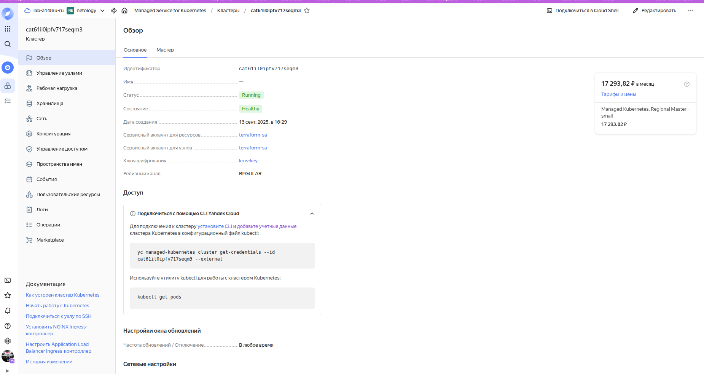
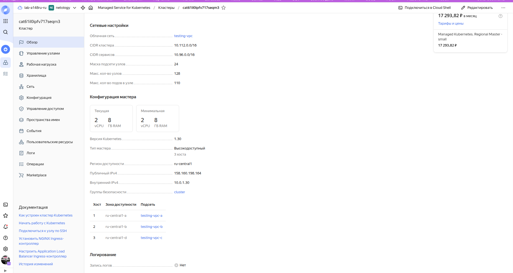
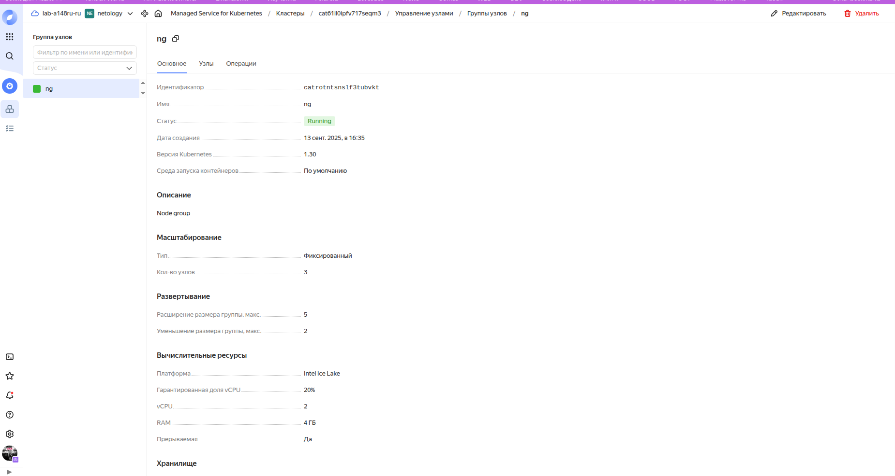
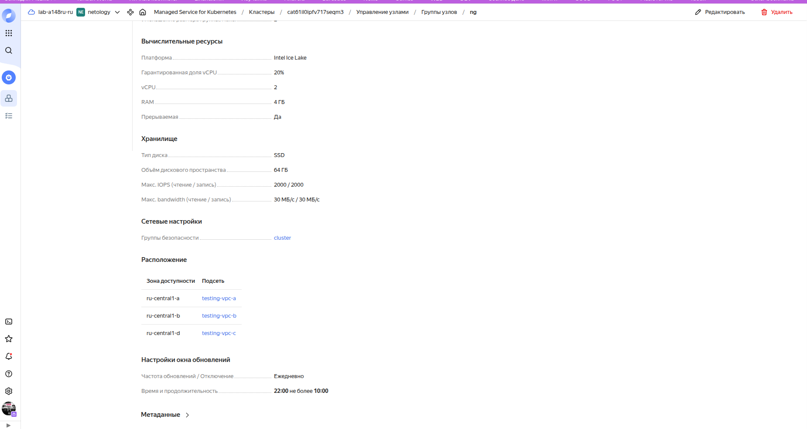
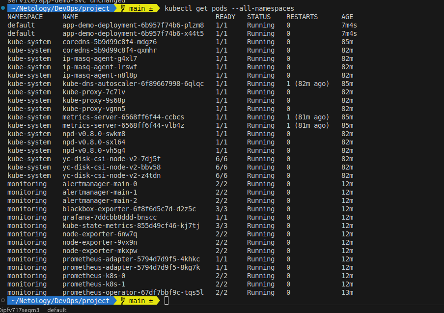

### Создание тестового приложения

Создано тестовое приложение https://github.com/a148ru/app_demo
Собраный docker image хранится в Yandex Container Registry (часть основной инфраструктуры)
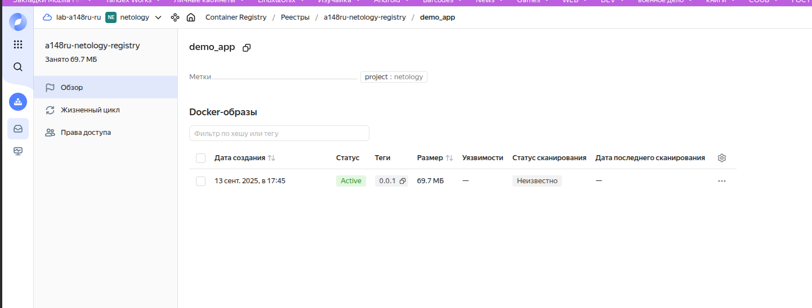

### Подготовка cистемы мониторинга и деплой приложения

Используется пакет kube-prometheus, собрана конфигурация по умолчанию, после чего внесены изменения в файл сервиса grafana (тип и порт)
grafana-service.yaml
```
apiVersion: v1
kind: Service
metadata:
  labels:
    app.kubernetes.io/component: grafana
    app.kubernetes.io/name: grafana
    app.kubernetes.io/part-of: kube-prometheus
    app.kubernetes.io/version: 12.1.0
  name: grafana
  namespace: monitoring
spec:
  ports:
  - name: http
    port: 80
    targetPort: http
  selector:
    app.kubernetes.io/component: grafana
    app.kubernetes.io/name: grafana
    app.kubernetes.io/part-of: kube-prometheus
  type: LoadBalancer
```
Тестовое приложение и grafana доступны по портам 80 с внешними ip-адресами

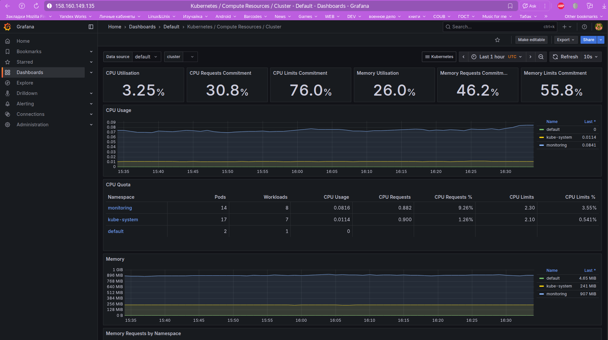
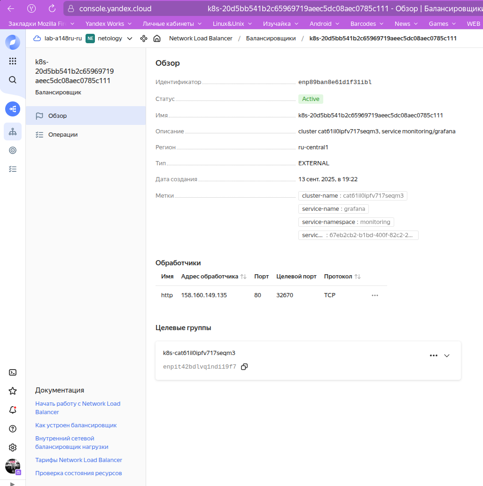
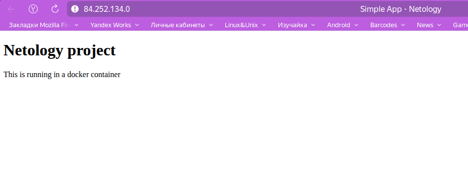
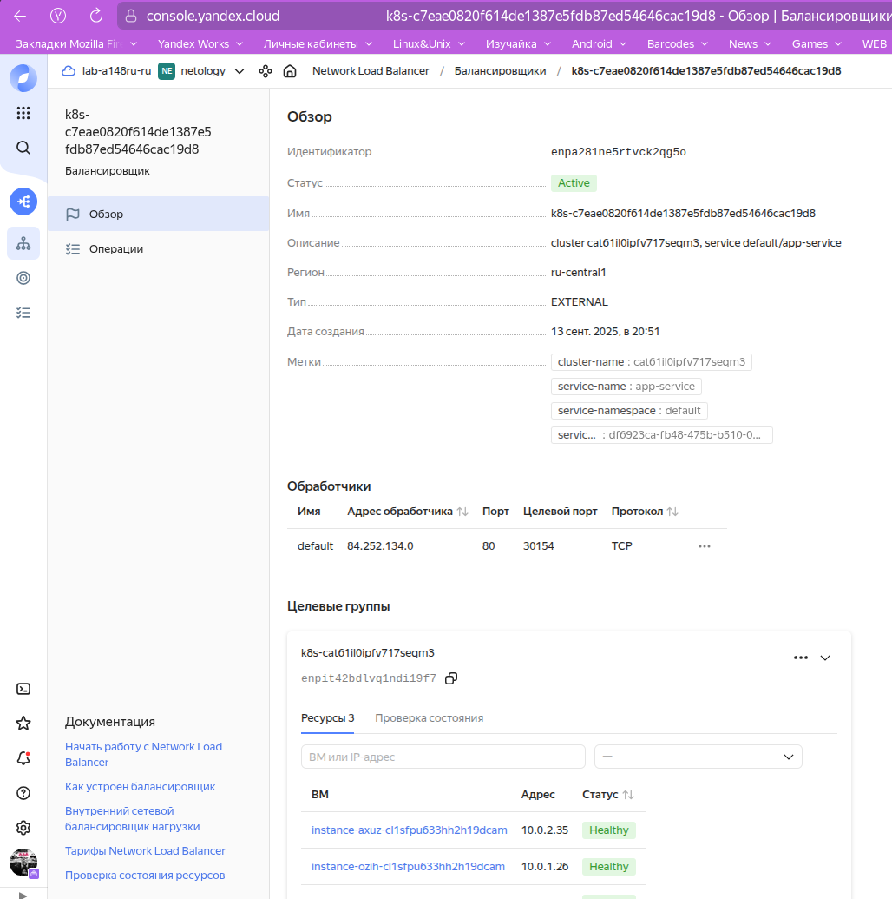

Настроен workflow на пуш в ветку main

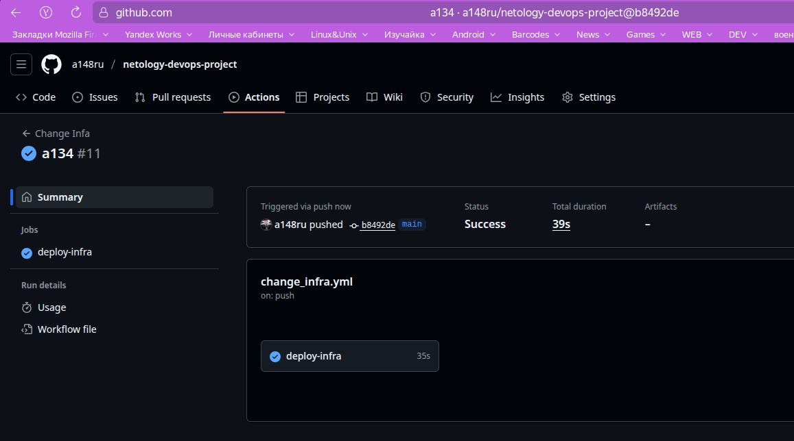


### Установка и настройка CI/CD

для деплоя приложения используется Github Action

#### 1. workflow при коммите в ветку main

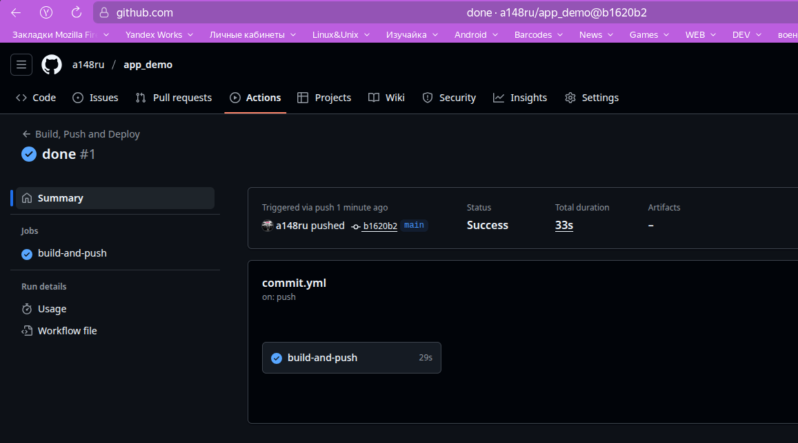

Отправка в registry


#### 2. workflow при создании тега
добавилил тег
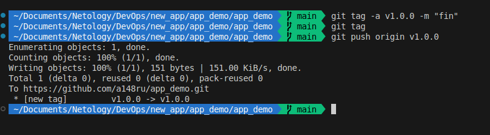
github action
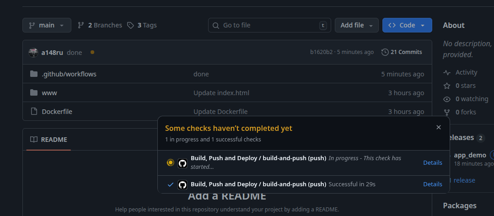
выполнено
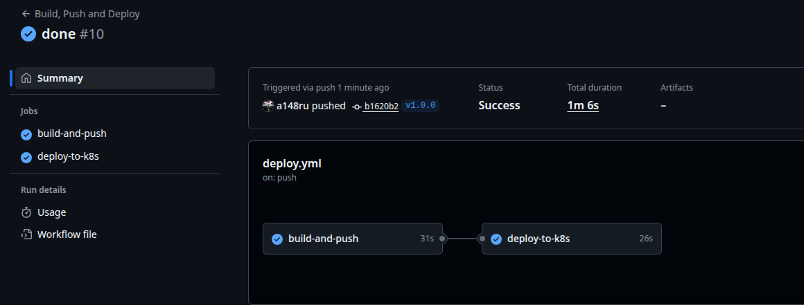
в registry есть нужный image
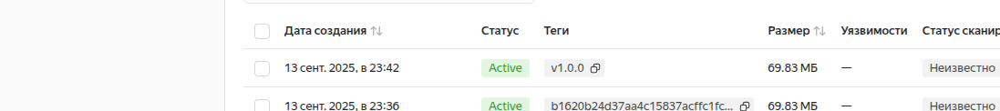
deployment использует новую версию приложения 
